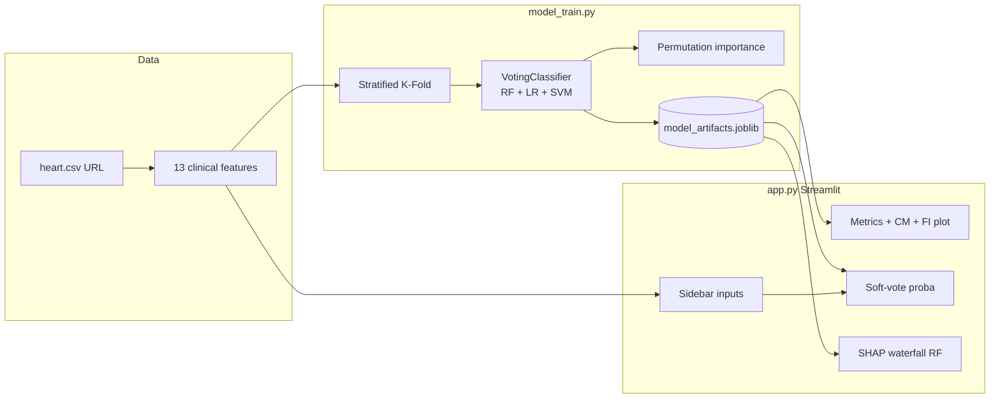

# Heart Disease Prediction System

A full-stack **machine learning + Streamlit** demo that predicts heart disease risk from UCI-style clinical features. It trains a **hybrid soft-voting ensemble** (Random Forest, Logistic Regression, SVM with scaling), evaluates with **stratified K-fold cross-validation**, and serves predictions through a **Medical Blue** themed dashboard with **global and local explainability**.

---

## Features

- **Data pipeline**: Automatically loads the public [Heart UCI CSV](https://raw.githubusercontent.com/sharmaroshan/Heart-UCI-Dataset/master/heart.csv) (same schema as classic UCI Heart Disease).
- **Hybrid model**: `VotingClassifier` with **soft voting** — averages predicted probabilities from:
  - **Random Forest** (non-linear, no scaling),
  - **Logistic Regression** + `StandardScaler`,
  - **SVM (RBF)** + `StandardScaler` with `probability=True`.
- **Robust validation**: **Stratified K-Fold** preserves class ratios; **out-of-fold** predictions drive the confusion matrix; mean CV accuracy is reported for the dashboard.
- **Global explainability**: **Permutation importance** on the full fitted ensemble (drop in accuracy when each feature is shuffled).
- **Local explainability**: **SHAP TreeExplainer** on the **Random Forest** base learner (additive breakdown for that component; the final score still combines all three models).
- **Streamlit UI**: Sidebar for all 13 features, metrics, confusion matrix, feature-importance chart, **Predict** with **High / Low risk** and **probability**, plus SHAP waterfall and input table.

---

## Architecture



**Artifact bundle** (`model_artifacts.joblib`): fitted `VotingClassifier`, feature names, CV metrics, confusion matrix, permutation importance vector, and a small background sample for SHAP.

---

## Project layout

| File | Role |
|------|------|
| `model_train.py` | Download data, train ensemble, cross-validate, save `model_artifacts.joblib` |
| `app.py` | Streamlit dashboard (Medical Blue theme) |
| `requirements.txt` | Python dependencies |
| `model_artifacts.joblib` | **Generated** — run training first |

---

## Setup

### 1. Environment

Use Python **3.10+** (tested on 3.12).

```bash
cd Heart-Disease-Prediction-Model
python -m pip install -r requirements.txt
```

On Windows, if `python` is not on your PATH:

```powershell
py -3 -m pip install -r requirements.txt
```

### 2. Train and save the model

```bash
python model_train.py
```

This creates `model_artifacts.joblib` in the project directory.

### 3. Launch the app

```bash
streamlit run app.py
```

Or:

```powershell
py -m streamlit run app.py
```

Open the URL shown in the terminal (default `http://localhost:8501`).

---

## Model notes (viva / report)

- **Why stratified folds?** The target can be slightly imbalanced; stratification keeps similar class proportions in each fold.
- **Why soft voting?** Each base estimator outputs class probabilities; averaging reduces variance vs. hard majority vote.
- **Why separate scalers for LR/SVM?** Tree models are scale-invariant; linear and RBF SVM benefit from normalized inputs. The forest branch uses raw features.
- **Confusion matrix**: Built from **cross-validated out-of-fold** predictions so it reflects generalization, not training-set memorization.
- **SHAP scope**: The waterfall explains the **Random Forest** sub-model; the headline risk uses the **full ensemble** probability.

---

## Disclaimer

This tool is for **education and demonstration** only. It is **not** a medical device and must not be used for clinical decisions.

---

## License

See `LICENSE` in this repository.
